# pKVM with SMMUv3 and SMMUv2 (Tegra234) – Design Notes

_This document summarizes our discussion about how pKVM integrates with Arm SMMUv3 and how an “orthodox” SMMUv2 driver for pKVM (especially on Tegra234 with MC coupling) should look architecturally._

The emphasis is on **architecture**, not exact upstream implementation details or Kconfig names.

---

## 1. Background and terminology

A few terms that will be used throughout:

- **EL0/EL1/EL2**  
  - EL0: userspace  
  - EL1: kernel (Linux host or guest)  
  - EL2: hypervisor (pKVM)

- **Stage-1 / Stage-2 translation (CPU)**  
  - **Stage-1**: VA → IPA/HPA, controlled by EL1.  
  - **Stage-2**: IPA/HPA → PA, controlled by EL2.  
  - For the **host**, stage-1 is Linux page tables, stage-2 is pKVM’s view of host memory.  
  - For a **guest**, guest stage-1 is guest Linux, guest stage-2 is the guest’s IPA→PA mapping controlled by EL2.

- **IOMMU / SMMU**  
  - **SMMUv3**: uses stream table entries (STE) + context descriptors (CD) and a generic I/O page table, typically managed via `io-pgtable-arm`.  
  - **SMMUv2**: more SoC-specific, often has **context banks**, master IDs / SWGROUPs, and uses an Arm v7s-like I/O page table.

- **IOVA**  
  - IOMMU virtual address. What a device issues on the bus.  
  - The SMMU translates **IOVA → HPA** (or IPA, depending on the configuration).

- **pKVM security model** (very condensed)  
  - EL2 owns Stage-2 and the SMMU.  
  - EL1 (host) is treated as untrusted _after_ pKVM initialization finishes.  
  - Host may request mappings, but EL2 validates them against its own metadata (ownership, donate/lend state, etc.) before touching Stage-2 or SMMU page tables.

---

## 2. CPU virtualization model in pKVM (mental model)

First, forget the IOMMU and only think about CPU translations.

### 2.1 Host

- **Stage-1 (host)**:  
  - Controlled by host Linux @ EL1.  
  - Maps host kernel/user virtual addresses → host physical addresses (HPA).

- **Stage-2 (host)**:  
  - Controlled by pKVM @ EL2.  
  - For host-owned memory, stage-2 is _almost_ a **unity mapping**:  
    - HPA → PA is 1:1 for the host’s allowed physical pages.  
  - For guest-owned or hyp-private pages, stage-2 is **no mapping** (abort on access).

So in practice, host CPU memory accesses see:

> VA (host) → HPA (host S1) → PA (EL2 S2, unity or abort)

This is where the “unity mapping or no mapping” slogan really comes from: it’s a good mental model for how EL2 controls host’s reachable memory while keeping things simple.

### 2.2 Guest

For a guest:

- Guest stage-1 (guest Linux) maps VA → IPA.  
- Guest stage-2 (EL2) maps IPA → PA.  
- EL2 uses strong ownership metadata so that guest-accessible PA ranges correspond to pages that were explicitly donated/lent to that guest.

---

## 3. SMMUv3 with pKVM

### 3.1 Design goals

For SMMUv3, the “modern” pKVM/AVF design is roughly:

- **EL2 owns the SMMU hardware**:
  - SMMU MMIO registers are mapped as EL2-only.
  - EL1 is not allowed to program SMMU directly after pKVM initialization.
- **EL1 still has a “normal-looking” IOMMU driver**:
  - It presents standard Linux IOMMU APIs (`iommu_domain`, `attach_dev`, `map`, `unmap`, etc).
  - But whenever EL1 wants to change IOMMU mappings, it calls into EL2 (hypercall / `kvm_iommu_ops`).
- **EL2 maintains the real I/O page tables**:
  - It programs the SMMU’s stream table + context descriptors + I/O page tables (IOVA → HPA).
  - It validates that all HPAs belong to host-owned memory (never guest or hyp-private).

### 3.2 Split driver structure

Conceptually, you can think of it like this:

- **Host side (EL1)**:  
  - `arm-smmu-v3-kvm` (name illustrative) acts as a front-end.
  - It keeps high-level IOMMU domains and device associations.
  - Instead of writing to SMMU registers, it makes hypercalls:

    - `map_pages(domain, iova, paddr, size, prot)`  
    - `unmap_pages(domain, iova, size)`  
    - `attach_dev(domain, dev)` / `detach_dev(domain, dev)`  
    - `tlb_sync` or similar.

- **Hypervisor side (EL2)**:  
  - pKVM core + SMMUv3 vendor module.  
  - Holds the actual SMMU configuration (STE/CD, I/O page tables).  
  - Implements the `map/unmap/attach` operations:

    1. Validate the host request (ownership, alignment, etc.).  
    2. Update its own I/O page tables (IOVA → HPA).  
    3. Program or update SMMU registers.  
    4. Perform TLB invalidation as required.

From Linux’s perspective, it still “has an IOMMU”, but real enforcement lives entirely at EL2.

### 3.3 I/O address translation path

On a DMA transaction:

1. Device issues a transaction to the interconnect with:
   - Stream ID (SID) / Substream ID (SSID).
   - IOVA (address in the device’s DMA address space).
2. SMMUv3:
   - Looks up the stream table entry (STE) using SID/SSID.
   - Follows the STE to the context descriptor (CD).
   - Uses the CD to find the I/O page table root.
3. I/O page table (maintained by EL2) translates:

> IOVA → HPA

4. The memory system then applies the **CPU stage-2** translation for the resulting HPA:

> HPA → PA (unity or abort, as described earlier).

The important part: **there is no architectural requirement that IOVA = HPA**.  
The I/O page table can be fully arbitrary, as long as EL2 enforces its security checks.

### 3.4 Where did “unity mapping only” come from?

There are really two separate “unity” ideas that can get conflated:

1. **CPU stage-2 (host view)**  
   - As above, host sees almost a unity mapping HPA→PA for its own pages; otherwise, no mapping.  
   - This is a design choice that simplifies reasoning about host’s allowed physical memory.

2. **Early SMMU integration option: sharing CPU S2 page tables**  
   - In early design options, one idea was to let the SMMU share the same page tables as CPU stage-2 (HPA→PA).  
   - From SMMU’s point of view this would look like:
     - Either the SMMU sees a unity HPA→PA mapping (host-owned pages), or
     - It sees no mapping (guest/hyp memory → no DMA).
   - That model *does* look very close to “unity or nothing” from the SMMU side.

The modern approach is to use **private I/O page tables** at EL2:

- SMMU has its own page tables (IOVA → HPA).  
- CPU stage-2 still does HPA → PA.  
- Together, you get: IOVA → HPA → PA.

That allows any reasonable IOVA layout and is not limited to unity mappings.

### 3.5 Graphviz: pKVM + SMMUv3 (host devices, no passthrough guests)

Below is the Graphviz source representing the SMMUv3 + pKVM model we discussed:

```dot
digraph pkvm_smmuv3 {
    rankdir=LR;
    fontsize=10;
    labelloc="t";
    label="pKVM + SMMUv3 address path (host device, non-passthrough guests)";

    node [shape=box, fontsize=9];

    subgraph cluster_cpu {
        label="CPU view";
        fontsize=10;
        style=rounded;

        host_s1  [label="Host S1 MMU\nEL1 page tables\nVA → HPA"];
        cpu_s2   [label="CPU S2 MMU\nEL2 page tables\nHPA → PA\n(almost unity for host)"];

        host_s1 -> cpu_s2 [style=dashed, label="load/store\nHPA check"];
    }

    subgraph cluster_smmu {
        label="SMMUv3 (owned by EL2)";
        fontsize=10;
        style=rounded;

        smmu          [label="SMMUv3\nHW"];
        host_ctx      [label="Host STE/CD\n(context)"];
        io_pt         [label="I/O pagetable\nIOVA → HPA\n(private to EL2)"];

        smmu -> host_ctx [style=dotted, label="stream match\n(SID/SSID)"];
        host_ctx -> io_pt [style=dotted, label="TTBR/CFGR"];
    }

    subgraph cluster_mem {
        label="Physical memory";
        fontsize=10;
        style=rounded;

        host_ram  [label="Host RAM pages\n(owner: host)", shape=folder];
        guest_ram [label="Guest RAM pages\n(owner: guest)\nNO SMMU mappings", shape=folder, style=dashed];
        hyp_ram   [label="Hyp / EL2 private RAM\nNO SMMU mappings", shape=folder, style=dotted];
    }

    subgraph cluster_sw {
        label="Software layers";
        fontsize=10;
        style=rounded;

        host_el1  [label="Host Linux @ EL1\narm-smmu-v3 host driver", shape=box, style=rounded];
        pkvm_el2  [label="pKVM @ EL2\nSMMU + CPU S2 control", shape=box, style=rounded];
        guest_el1 [label="Guest VM @ EL1\nvIOMMU / virtio-iommu", shape=box, style="rounded,dashed"];

        host_el1 -> pkvm_el2 [label="hypercalls:\nmap/unmap,\nattach_dev,..."];
        guest_el1 -> host_el1 [label="emulated vIOMMU\n/ virtio-iommu", style=dashed];
    }

    dev [label="DMA device\n(e.g. PCIe GPU/NVMe)"];

    // DMA path
    dev -> smmu    [label="DMA request\n(IOVA)", fontsize=9];
    smmu -> io_pt  [label="translation\nIOVA → HPA", fontsize=9];
    io_pt -> host_ram [label="HPA targets only\nhost-owned pages", fontsize=9];

    // Constraint: never map guest/hyp RAM
    io_pt -> guest_ram [style=dotted, color=gray, label="DISALLOWED:\nno mapping", fontsize=8];
    io_pt -> hyp_ram   [style=dotted, color=gray, label="DISALLOWED:\nno mapping", fontsize=8];

    // Control edges
    pkvm_el2 -> smmu   [label="programs SMMU regs,\nI/O pagetables", fontsize=8];
    pkvm_el2 -> cpu_s2 [label="controls CPU S2\n(HPA → PA)", fontsize=8];
}
```



You can render this with something like:

```bash
dot -Tpng pkvm_smmuv3.dot -o pkvm_smmuv3.png
```

---

## 4. Extending the model to SMMUv2

Architecturally, an “orthodox” SMMUv2 integration for pKVM should look **very similar** to the SMMUv3 picture:

- EL2 owns the SMMUv2 hardware.
- EL1 has a front-end driver that exposes normal Linux IOMMU APIs.
- EL2 maintains the real I/O page tables and context configuration.
- CPU stage-2 remains the same (almost unity for host, nothing for guest/hyp).

The main differences are in the **SMMU hardware internals**.

### 4.1 SMMUv2-specific hardware aspects

Compared to SMMUv3, SMMUv2 usually has:

- **No STE/CD RAM structure**:
  - Instead, it uses **context banks** or equivalent hardware structures.
  - Each master (or group of masters) is associated with a context bank via master ID / SWGROUP registers.
- **ASID and PT root registers**:
  - For each context bank, there are registers like “TTBR / PTC / TTBCR” or SoC-specific equivalents.
  - Some SoCs (like Tegra) have additional MC registers that set SWGROUP → ASID or SWGROUP → context-bank mappings.
- **Arm v7s I/O page table format**:
  - Typically 2-level page tables, PDE + PTE.
  - 4KB pages, often 1024 entries per level (exact encoding depends on implementation).
  - Linux uses `io-pgtable-arm-v7s` or similar helpers to manage these tables.

In a pKVM world, all of this low-level programming is done by EL2.

### 4.2 Split driver for SMMUv2

From Linux’s perspective, a pKVM-aware SMMUv2 driver would look like:

- **EL1 front-end**:
  - Exposes `struct iommu_ops` as usual.  
  - Implements domain creation, attach/detach, map/unmap.  
  - But **does not program SMMU registers directly** after pKVM is active.  
  - Instead, it calls into pKVM:

    - `kvm_iommu_map(domain_id, iova, hpa, size, prot)`  
    - `kvm_iommu_unmap(domain_id, iova, size)`  
    - `kvm_iommu_attach(dev, domain_id)`  
    - `kvm_iommu_detach(dev)`

- **EL2 back-end (vendor module)**:
  - Owns the SMMUv2 MMIO and (on Tegra) usually the MC MMIO as well.  
  - Maintains:

    - I/O page tables (v7s style).  
    - Context bank configuration.  
    - SWGROUP/master → context-bank/ASID mappings.  

  - On `map`/`unmap`, it:

    1. Validates HPA ownership and access rights.
    2. Updates the v7s page tables.
    3. Performs the appropriate TLB/PTC flush operations.
    4. Ensures that context-bank configuration is consistent.

Visually, it’s the same picture as SMMUv3, just with different labels inside the “SMMU” box.

### 4.3 Trap & emulate vs split-driver

There are two conceptual implementation strategies:

1. **Trap & emulate SMMUv2 MMIO**  
   - Keep the existing SMMUv2 driver in the host mostly unchanged.  
   - Map SMMU registers as stage-2 protected MMIO so that EL2 traps all SMMU access.  
   - EL2 emulates each register write/read, updates its own shadow state and page tables.  
   - Pros:
     - Minimal changes in the host driver.
   - Cons:
     - A lot of emulation code at EL2.
     - Harder to maintain and reason about.

2. **Clean split-driver** (**recommended** for long term)  
   - Refactor the SMMUv2 host driver into an EL1 front-end that never touches HW registers.  
   - Implement the hardware-specific parts as an EL2 back-end that uses the same low-level primitives as the old driver (TLB invalidation, page table writing, etc.).  
   - Pros:
     - Cleaner architecture.
     - Easier to audit and maintain.

Both approaches are possible, but the split-driver pattern matches the SMMUv3 design and is the more “orthodox” pKVM design.

---

## 5. Tegra234 SMMUv2 + MC integration under pKVM

Tegra234-style SoCs add an extra twist: the **Memory Controller (MC)** participates in the IOMMU flow via SWGROUPs and overrides.

### 5.1 Classic (non-pKVM) Tegra model

In a typical non-pKVM Linux on Tegra234:

- The **MC driver**:
  - Sets up SWGROUP → ASID / master-ID mappings.
  - Potentially rewrites or overrides stream IDs from clients.
- The **Tegra SMMUv2 driver**:
  - Configures the SMMU context banks / page tables for each ASID.
  - Relies on MC to route transactions to the correct context.

The two drivers are coupled: you can’t reason about IOMMU behavior without also looking at MC configuration.

### 5.2 “Orthodox” pKVM design for Tegra

In pKVM, the authority must move from EL1 to EL2. That leads to:

- **EL2 vendor module owns both MC and SMMU**:
  - MC MMIO is mapped only at EL2.
  - SMMU MMIO is mapped only at EL2.
  - EL2 has a private data structure describing SWGROUPs, masters, and context-banks.

- **EL1 sees a clean IOMMU**:
  - EL1 front-end driver for Tegra’s SMMUv2 exposes a standard IOMMU API.  
  - It doesn’t touch MC or SMMU registers after pKVM is initialized.  
  - Every attach/map/unmap goes via hypercalls.

- **Attach_dev in pKVM on Tegra**:
  - When EL1 calls `attach_dev(domain, dev)`:
    1. EL2 looks up the device’s SWGROUP / master ID(s).
    2. Chooses or creates a context bank / ASID for that domain.
    3. Programs MC registers to map that SWGROUP to the chosen context bank/ASID.
    4. Programs SMMU context bank registers accordingly.
    5. Ensures the I/O page tables for that domain exist.

By doing this entirely at EL2, we ensure that:

- EL1 cannot re-route a device into a context that sees guest or hyp memory.  
- EL1 cannot bypass IOMMU by playing games with MC SWGROUP configuration.

### 5.3 Graphviz: pKVM + SMMUv2 + Tegra MC (conceptual)

Below is a conceptual Graphviz diagram for the Tegra-style SMMUv2 + MC under pKVM:

```dot
digraph pkvm_smmuv2_tegra {
    rankdir=LR;
    fontsize=10;
    labelloc="t";
    label="pKVM + SMMUv2 + Tegra MC (conceptual)";

    node [shape=box, fontsize=9];

    subgraph cluster_cpu {
        label="CPU view";
        fontsize=10;
        style=rounded;

        host_s1  [label="Host S1 MMU\nEL1 page tables\nVA → HPA"];
        cpu_s2   [label="CPU S2 MMU\nEL2 page tables\nHPA → PA\n(almost unity for host)"];

        host_s1 -> cpu_s2 [style=dashed, label="load/store\nHPA check"];
    }

    subgraph cluster_mc {
        label="Tegra MC";
        fontsize=10;
        style=rounded;

        mc  [label="MC HW\n(SWGROUP routing,\nSID/ASID overrides)"];
    }

    subgraph cluster_smmu {
        label="SMMUv2 (owned by EL2)";
        fontsize=10;
        style=rounded;

        smmu       [label="SMMUv2\nHW"];
        cb_host    [label="Context bank(s)\nASID + TTBR regs"];
        io_pt      [label="I/O pagetable\n(v7s) IOVA → HPA\n(private to EL2)"];

        smmu -> cb_host [style=dotted, label="master/SWGROUP\n→ context bank/ASID"];
        cb_host -> io_pt [style=dotted, label="TTBR / TTBCR"];
    }

    subgraph cluster_mem {
        label="Physical memory";
        fontsize=10;
        style=rounded;

        host_ram  [label="Host RAM pages\n(owner: host)", shape=folder];
        guest_ram [label="Guest RAM pages\n(owner: guest)\nNO SMMU mappings", shape=folder, style=dashed];
        hyp_ram   [label="Hyp / EL2 private RAM\nNO SMMU mappings", shape=folder, style=dotted];
    }

    subgraph cluster_sw {
        label="Software layers";
        fontsize=10;
        style=rounded;

        host_el1  [label="Host Linux @ EL1\nTegra SMMU front-end", shape=box, style=rounded];
        pkvm_el2  [label="pKVM @ EL2\nMC + SMMU control", shape=box, style=rounded];
        guest_el1 [label="Guest VM @ EL1\nvIOMMU / virtio-iommu", shape=box, style="rounded,dashed"];

        host_el1 -> pkvm_el2 [label="hypercalls:\nmap/unmap,\nattach_dev,..."];
        guest_el1 -> host_el1 [label="emulated vIOMMU\n/ virtio-iommu", style=dashed];
    }

    dev [label="DMA device\n(e.g. PCIe GPU/NVMe)"];

    // DMA path
    dev -> mc      [label="DMA request\n(master ID, IOVA)", fontsize=9];
    mc  -> smmu    [label="routed with SWGROUP\n→ context bank/ASID", fontsize=9];
    smmu -> io_pt  [label="translation\nIOVA → HPA", fontsize=9];
    io_pt -> host_ram [label="HPA targets only\nhost-owned pages", fontsize=9];

    // Constraint: never map guest/hyp RAM
    io_pt -> guest_ram [style=dotted, color=gray, label="DISALLOWED:\nno mapping", fontsize=8];
    io_pt -> hyp_ram   [style=dotted, color=gray, label="DISALLOWED:\nno mapping", fontsize=8];

    // Control edges
    pkvm_el2 -> mc     [label="programs SWGROUP\nrouting / overrides", fontsize=8];
    pkvm_el2 -> smmu   [label="programs SMMU regs,\nI/O pagetables", fontsize=8];
    pkvm_el2 -> cpu_s2 [label="controls CPU S2\n(HPA → PA)", fontsize=8];
}
```



Again, the rendering command is something like:

```bash
dot -Tpng pkvm_smmuv2_tegra.dot -o pkvm_smmuv2_tegra.png
```

---

## 6. Key takeaways

- **No intrinsic “unity-only” limitation for SMMUv3 in pKVM**:
  - The SMMU uses private I/O page tables at EL2.
  - IOVA→HPA mappings can be arbitrary; identity is just one option.
  - The “unity or no mapping” mental model applies to **CPU stage-2** for host memory, not to the IOMMU address space in general.

- **pKVM security hinges on EL2 owning both Stage-2 and SMMU**:
  - EL1 (host) is treated as untrusted after initialization.  
  - All IOMMU mappings must go through EL2, which checks ownership and access rights.

- **SMMUv2 under pKVM should architecturally mirror the SMMUv3 design**:
  - EL2 vendor module: SMMUv2 page tables, context banks, TLB management.  
  - EL1 front-end: only calls into EL2, never directly programs the hardware.

- **On Tegra234, MC must also be moved under EL2 control**:
  - MC SWGROUP / context routing and SMMU configuration are tightly coupled.  
  - Letting EL1 change MC registers after pKVM is active would violate the security model.

- **Trap & emulate vs split-driver**:
  - Trap & emulate: fewer host changes, but higher complexity at EL2.  
  - Split-driver: cleaner long-term design, better matches pKVM + SMMUv3 model.

If you treat the SMMU + MC block as “just another Stage-2-like translation engine fully owned by EL2”, the overall picture becomes conceptually simple:

> Device IOVA → (SMMU/MC @ EL2) → HPA → (CPU S2 @ EL2) → PA

with the guarantee that EL2 never allows SMMU mappings into guest or hyp-private memory.
